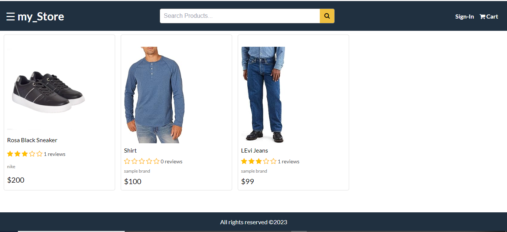

# E-Commerce Web App (MERN Stack)


Welcome to my E-Commerce Web App (my_Store), a full-stack application built with the MERN (MongoDB, Express.js, React, Node.js) stack. This project aims to provide a robust and scalable platform for online shopping.

## Table of Contents

- [Features](#features)
- [Prerequisites](#prerequisites)
- [Installation](#installation)
- [Usage](#usage)
- [Folder Structure](#folder-structure)
- [Technologies Used](#technologies-used)
- [Contributing](#contributing)
- [License](#license)

## Features

- User authentication and authorization.
- Product catalog with detailed product pages.
- Shopping cart functionality.
- Secure payment gateway integration.
- Order history and tracking.
- Admin panel for managing products, orders, and users.

## Prerequisites

Before you begin, ensure you have the following installed:

- [Node.js](https://nodejs.org/)
- [MongoDB](https://www.mongodb.com/try/download/community)

## Installation

1. Clone the repository:
   ```bash
   git clone https://github.com/FREDRICKKYEKI/my_store
   ```
2. Change to the project directory:
   ```bash
   cd my_store
   ```
3. Install dependencies for both the client and server:
   ```bash
   cd frontend
   npm install
   cd ../backend
   npm install
   ```

## Usage

1. Start the MongoDB server:
   ```bash
   mongod
   ```
2. In a separate terminal, start the server (back-end):
   ```bash
   cd server
   npm start
   ```
3. In another terminal, start the client (frontend):
   ```bash
   cd client
   npm start
   ```
4. Open your browser and go to [http://localhost:3000](http://localhost:3000) to view the app.

## Folder Structure

```
ecommerce-web-app/
|-- frontend/                  # React client application
        |
        |-- public/            # Static assets
        |-- src/               # React source code
            |
            |-- components/    # React components
            |-- contexts/      # React contexts
            |-- screens/       # React pages
            |-- utils/         # Utility functions
            |-- styles/        # CSS styles
            |-- App.tsx        # React application
            |-- main.tsx       # React root
|-- backend/                   # Express.js server application
        |
        | -- dist/             # Compiled JavaScript
        | -- models/           # MongoDB models
        | -- routers/          # Express.js routes
        | -- uploads/          # File uploads
        | -- config.ts         # Configuration file
        | -- data.ts           # init Data file
        | -- server.ts         # Express.js server
        | -- package.json      # Node.js dependencies
        | -- tsconfig.json     # TypeScript configuration
```

## Technologies Used

- [React](https://reactjs.org/) - Frontend library
- [Node.js](https://nodejs.org/) - JavaScript runtime
- [Express.js](https://expressjs.com/) - Web application framework
- [MongoDB](https://www.mongodb.com/) - NoSQL database
- [Mongoose](https://mongoosejs.com/) - MongoDB object modeling for Node.js

## Contributing

Feel free to contribute to the development of this project.

## Credits

- [Basil](https://github.com/basir/) - [Build Ecommerce Like Amazon By JavaScript Node & MongoDB](https://github.com/basir/node-javascript-ecommerce)
  Thank you so much for taking your time to make this tutorial... You have given me the chance to learn alot about the MERN STACK🙏🙏🙏🙏!

## License

This project is licensed under the [MIT License](LICENSE).
